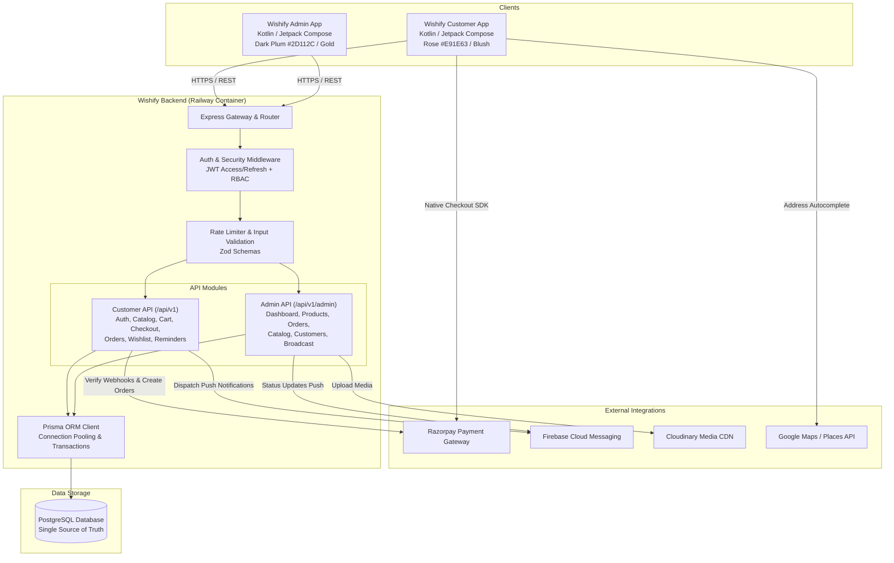

# Wishify: System Architecture & Specification

## 1. Executive Summary
**Wishify** ("Wish it. Gift it. Delivered.") is a full-stack, enterprise-grade online gifting platform inspired by Ferns N Petals (FNP). The platform facilitates the seamless discovery, customization, and scheduled delivery of flowers, cakes, plants, chocolates, personalized gifts, and curated gift combos.

The architecture comprises three core systems sharing a single PostgreSQL relational database:
1. **Backend Service**: High-throughput REST API built with Node.js, TypeScript, Express, Prisma ORM, Zod validation, and OpenAPI 3.0 documentation, containerized for Railway deployment.
2. **Wishify Customer App**: Modern Android application built with Kotlin, Jetpack Compose, Material 3, Clean Architecture (MVVM), and offline-first Room caching.
3. **Wishify Admin App**: Purpose-built operational Android application for inventory managers, store operators, and fulfillment agents with biometric security, dark plum/gold theming, and real-time order lifecycle tracking.

---

## 2. High-Level System Architecture



---

## 3. Relational Database Schema (ER Diagram)

The database schema is managed via Prisma ORM and contains 22 models designed for high transactional consistency, auditing, and multi-tenant operational security.

```mermaid
erDiagram
    User ||--o{ Address : "has many"
    User ||--o{ Order : "places"
    User ||--o{ Cart : "owns"
    User ||--o{ Review : "writes"
    User ||--o{ Wishlist : "saves"
    User ||--o{ Reminder : "sets"
    User ||--o{ Notification : "receives"
    User ||--o{ DeviceToken : "registers"

    Category ||--o{ Product : "categorizes"
    Category ||--o{ Category : "sub-categories"

    Occasion ||--o{ Product : "tagged in"

    Product ||--o{ ProductVariant : "has variants"
    Product ||--o{ ProductImage : "has images"
    Product ||--o{ AddOn : "associated add-ons"
    Product ||--o{ Review : "reviewed in"
    Product ||--o{ CartItem : "in cart"
    Product ||--o{ OrderItem : "in orders"
    Product ||--o{ Wishlist : "in wishlist"

    Cart ||--o{ CartItem : "contains"
    CartItem ||--o{ CartItemAddOn : "has add-ons"

    Order ||--o{ OrderItem : "contains"
    Order ||--o{ OrderStatusHistory : "status timeline"
    Order ||--o{ Payment : "has payments"
    OrderItem ||--o{ OrderItemAddOn : "includes"

    Coupon ||--o{ Order : "applied to"
    Pincode ||--o{ DeliverySlot : "available slots"
    DeliverySlot ||--o{ Order : "scheduled in"

    User {
        string id PK
        string phone UK
        string email UK
        string name
        string role "CUSTOMER | ADMIN | SUPER_ADMIN"
        string passwordHash
        boolean isPhoneVerified
        boolean isActive
        datetime createdAt
        datetime updatedAt
    }

    Address {
        string id PK
        string userId FK
        string name
        string phone
        string addressLine1
        string addressLine2
        string landmark
        string city
        string state
        string pincode
        float latitude
        float longitude
        string addressType "HOME | WORK | OTHER"
        boolean isDefault
    }

    Category {
        string id PK
        string name
        string slug UK
        string description
        string imageUrl
        string parentId FK
        boolean isActive
        int sortOrder
    }

    Occasion {
        string id PK
        string name
        string slug UK
        string description
        string bannerUrl
        boolean isActive
        int sortOrder
    }

    Product {
        string id PK
        string title
        string slug UK
        string description
        string categoryId FK
        string occasionId FK
        float basePrice
        float compareAtPrice
        boolean isVegetarian
        boolean isPersonalized
        string personalizationPrompt
        boolean isSameDayEligible
        boolean isMidnightEligible
        boolean isActive
        float averageRating
        int reviewCount
        datetime createdAt
    }

    ProductVariant {
        string id PK
        string productId FK
        string title
        float price
        float compareAtPrice
        string sku UK
        int stockQuantity
        string weightOrSize
        boolean isDefault
    }

    AddOn {
        string id PK
        string title
        string description
        float price
        string imageUrl
        int stockQuantity
        boolean isActive
    }

    ProductImage {
        string id PK
        string productId FK
        string imageUrl
        string altText
        int sortOrder
        boolean isPrimary
    }

    Banner {
        string id PK
        string title
        string subtitle
        string imageUrl
        string deepLink
        string position "HOME_TOP | HOME_MIDDLE | CATEGORY"
        boolean isActive
        int sortOrder
    }

    Coupon {
        string id PK
        string code UK
        string description
        string discountType "PERCENTAGE | FLAT"
        float discountValue
        float minOrderValue
        float maxDiscountAmount
        datetime validFrom
        datetime validTo
        int usageLimit
        int usedCount
        boolean isActive
    }

    Cart {
        string id PK
        string userId FK UK
        datetime createdAt
        datetime updatedAt
    }

    CartItem {
        string id PK
        string cartId FK
        string productId FK
        string variantId FK
        int quantity
        string personalizationText
        datetime deliveryDate
        string deliverySlotId FK
    }

    CartItemAddOn {
        string id PK
        string cartItemId FK
        string addOnId FK
        int quantity
    }

    Order {
        string id PK
        string orderNumber UK
        string userId FK
        string addressId FK
        float subtotal
        float deliveryFee
        float discountAmount
        float taxAmount
        float totalAmount
        string couponCode
        string orderStatus "PLACED | CONFIRMED | PREPARED | OUT_FOR_DELIVERY | DELIVERED | CANCELLED"
        string paymentStatus "PENDING | PAID | FAILED | REFUNDED"
        string paymentMethod "RAZORPAY | COD | WALLET"
        datetime deliveryDate
        string deliverySlotId FK
        string recipientName
        string recipientPhone
        string giftMessage
        boolean isSenderHidden
        string deliveryPartnerName
        string deliveryPartnerPhone
        string trackingNumber
        string cancelReason
        datetime createdAt
        datetime updatedAt
    }

    OrderItem {
        string id PK
        string orderId FK
        string productId FK
        string variantId FK
        string title
        string variantTitle
        float unitPrice
        int quantity
        float totalPrice
        string personalizationText
        string imageUrl
    }

    OrderItemAddOn {
        string id PK
        string orderItemId FK
        string addOnId FK
        string title
        float unitPrice
        int quantity
        float totalPrice
    }

    OrderStatusHistory {
        string id PK
        string orderId FK
        string status
        string notes
        string updatedByUserId FK
        datetime createdAt
    }

    Payment {
        string id PK
        string orderId FK
        string paymentId UK
        string transactionReference
        float amount
        string currency
        string status
        string gateway "RAZORPAY | COD"
        json rawPayload
        datetime createdAt
    }

    Review {
        string id PK
        string productId FK
        string userId FK
        int rating
        string comment
        string status "PENDING | APPROVED | REJECTED"
        datetime createdAt
    }

    Wishlist {
        string id PK
        string userId FK
        string productId FK
        datetime createdAt
    }

    Reminder {
        string id PK
        string userId FK
        string occasionTitle
        string recipientName
        datetime eventDate
        int remindDaysBefore
        datetime createdAt
    }

    Pincode {
        string id PK
        string code UK
        string city
        string state
        boolean isServiceable
        boolean isSameDayAvailable
        boolean isMidnightAvailable
        float standardDeliveryFee
        float midnightDeliveryFee
    }

    DeliverySlot {
        string id PK
        string title
        string slotType "EARLY_MORNING | STANDARD | FIXED_TIME | MIDNIGHT"
        string startTime
        string endTime
        float fee
        int cutoffHoursBefore
        boolean isActive
    }

    Notification {
        string id PK
        string userId FK
        string title
        string body
        string type "ORDER_UPDATE | PROMOTIONAL | REMINDER"
        json metadata
        boolean isRead
        datetime createdAt
    }

    DeviceToken {
        string id PK
        string userId FK
        string token UK
        string platform "ANDROID | IOS | WEB"
        datetime updatedAt
    }
```

---

## 4. API Contract

All API responses follow a uniform JSON response envelope:
```json
{
  "success": true,
  "data": {},
  "error": null
}
```
Or on error:
```json
{
  "success": false,
  "data": null,
  "error": {
    "code": "RESOURCE_NOT_FOUND",
    "message": "Product with slug 'red-roses-bouquet' not found",
    "details": []
  }
}
```

### 4.1 Customer API (`/api/v1`)
| Method | Endpoint | Description | Auth Required |
|---|---|---|---|
| POST | `/auth/request-otp` | Request phone login OTP | No |
| POST | `/auth/verify-otp` | Verify OTP, issue access & refresh JWTs | No |
| POST | `/auth/refresh-token` | Renew access token | No |
| GET | `/auth/me` | Fetch customer profile | Yes (Customer) |
| PUT | `/auth/me` | Update customer profile | Yes (Customer) |
| GET | `/addresses` | List saved addresses | Yes (Customer) |
| POST | `/addresses` | Add new address | Yes (Customer) |
| PUT | `/addresses/:id` | Update address | Yes (Customer) |
| DELETE | `/addresses/:id` | Delete address | Yes (Customer) |
| GET | `/home` | Home feed: banners, categories, occasions, curated rows | No |
| GET | `/categories` | List all active categories | No |
| GET | `/occasions` | List all active occasions | No |
| GET | `/products` | List products with filters (category, occasion, price, veg, rating, sort, pagination) | No |
| GET | `/products/search` | Search autocomplete and query results | No |
| GET | `/products/:slug` | Get full product detail, variants, add-ons, reviews | No |
| GET | `/pincode/check/:code` | Validate delivery pincode & available delivery slot types | No |
| GET | `/delivery-slots` | Available slots for a specific date and pincode | No |
| GET | `/cart` | Get current user's cart with calculated totals | Yes (Customer) |
| POST | `/cart/items` | Add item to cart (with variant, add-ons, date, slot) | Yes (Customer) |
| PUT | `/cart/items/:id` | Update cart item quantity or add-ons | Yes (Customer) |
| DELETE | `/cart/items/:id` | Remove item from cart | Yes (Customer) |
| POST | `/coupons/validate` | Validate coupon code against cart value | Yes (Customer) |
| POST | `/checkout/initiate` | Create draft order & Razorpay order ID | Yes (Customer) |
| POST | `/checkout/verify` | Verify Razorpay payment signature & confirm order | Yes (Customer) |
| GET | `/orders` | Paginated list of customer orders | Yes (Customer) |
| GET | `/orders/:id` | Order details with status history timeline | Yes (Customer) |
| POST | `/orders/:id/cancel` | Cancel order (if eligible prior to preparation) | Yes (Customer) |
| GET | `/orders/:id/invoice` | Download/view invoice summary | Yes (Customer) |
| GET | `/wishlist` | Get user's wishlist | Yes (Customer) |
| POST | `/wishlist/:productId`| Add product to wishlist | Yes (Customer) |
| DELETE | `/wishlist/:productId`| Remove product from wishlist | Yes (Customer) |
| GET | `/reminders` | List birthday/anniversary reminders | Yes (Customer) |
| POST | `/reminders` | Create reminder | Yes (Customer) |
| DELETE | `/reminders/:id` | Delete reminder | Yes (Customer) |
| POST | `/products/:id/reviews` | Submit product review | Yes (Customer) |
| GET | `/notifications` | List user notifications | Yes (Customer) |
| POST | `/notifications/token` | Register/update FCM device token | Yes (Customer) |

### 4.2 Admin API (`/api/v1/admin`)
| Method | Endpoint | Description | Role Required |
|---|---|---|---|
| POST | `/auth/login` | Admin email & password login | No |
| GET | `/dashboard/stats` | Today's revenue, order counts, pending, low stock | Admin |
| GET | `/dashboard/charts` | Sales & orders 30-day analytics | Admin |
| GET | `/orders` | Paginated orders with status, date & search filters | Admin |
| GET | `/orders/:id` | Detailed order view with status logs | Admin |
| PATCH | `/orders/:id/status`| Update status (Placed -> Confirmed -> Prepared -> Out -> Delivered) | Admin |
| POST | `/orders/:id/assign`| Assign delivery partner & tracking number | Admin |
| POST | `/orders/:id/refund`| Issue refund for cancelled order | Admin |
| GET | `/products` | List all products (including inactive) | Admin |
| POST | `/products` | Create new product with variants & add-ons | Admin |
| PUT | `/products/:id` | Update product details, stock, pricing | Admin |
| DELETE | `/products/:id` | Soft delete / toggle active state | Admin |
| POST | `/media/upload` | Upload product image to Cloudinary CDN | Admin |
| GET | `/categories` | CRUD categories | Admin |
| POST | `/categories` | Create category | Admin |
| PUT | `/categories/:id` | Update category | Admin |
| GET | `/occasions` | CRUD occasions | Admin |
| POST | `/occasions` | Create occasion | Admin |
| GET | `/coupons` | CRUD coupons | Admin |
| POST | `/coupons` | Create coupon | Admin |
| GET | `/pincodes` | Manage serviceable pincodes & slot delivery fees | Admin |
| POST | `/pincodes` | Add or update pincode serviceability | Admin |
| GET | `/slots` | Manage delivery slots | Admin |
| GET | `/customers` | List registered customers & order metrics | Admin |
| GET | `/reviews` | Review moderation queue | Admin |
| PATCH | `/reviews/:id` | Approve or reject review | Admin |
| POST | `/broadcast/push` | Send broadcast FCM push notification | Admin |
| GET | `/users` | List admin users | Super Admin |
| POST | `/users` | Create admin user | Super Admin |

---

## 5. Folder Structures

### 5.1 Backend (`backend/`)
```
backend/
├── prisma/
│   ├── schema.prisma
│   └── seed.ts
├── src/
│   ├── config/
│   │   ├── env.ts
│   │   └── constants.ts
│   ├── middleware/
│   │   ├── auth.middleware.ts
│   │   ├── error.middleware.ts
│   │   ├── role.middleware.ts
│   │   └── validate.middleware.ts
│   ├── modules/
│   │   ├── admin/
│   │   │   ├── auth/
│   │   │   ├── catalog/
│   │   │   ├── dashboard/
│   │   │   ├── media/
│   │   │   ├── orders/
│   │   │   └── users/
│   │   └── customer/
│   │       ├── address/
│   │       ├── auth/
│   │       ├── cart/
│   │       ├── catalog/
│   │       ├── checkout/
│   │       ├── orders/
│   │       ├── pincode/
│   │       ├── reminders/
│   │       └── wishlist/
│   ├── services/
│   │   ├── cloudinary.service.ts
│   │   ├── fcm.service.ts
│   │   ├── prisma.service.ts
│   │   └── razorpay.service.ts
│   ├── utils/
│   │   ├── api-response.ts
│   │   ├── logger.ts
│   │   └── order-number.ts
│   ├── app.ts
│   └── server.ts
├── tests/
│   ├── auth.test.ts
│   ├── cart.test.ts
│   └── order.test.ts
├── Dockerfile
├── package.json
├── railway.json
└── tsconfig.json
```

### 5.2 Customer App (`customer-app/`)
```
customer-app/
├── app/
│   ├── src/main/
│   │   ├── java/com/wishify/customer/
│   │   │   ├── WishifyApplication.kt
│   │   │   ├── data/
│   │   │   │   ├── local/
│   │   │   │   │   ├── db/ (Room database, DAOs, entities)
│   │   │   │   │   └── datastore/ (UserPreferences)
│   │   │   │   ├── remote/
│   │   │   │   │   ├── api/ (WishifyCustomerApi)
│   │   │   │   │   ├── dto/ (DTOs & Kotlinx serialization models)
│   │   │   │   │   └── interceptor/ (AuthInterceptor, TokenAuthenticator)
│   │   │   │   └── repository/ (ProductRepositoryImpl, CartRepositoryImpl, OrderRepositoryImpl, etc.)
│   │   │   ├── domain/
│   │   │   │   ├── model/ (Product, Variant, CartItem, Order, Address, etc.)
│   │   │   │   └── repository/ (Domain interfaces)
│   │   │   ├── presentation/
│   │   │   │   ├── auth/ (LoginScreen, OtpScreen, AuthViewModel)
│   │   │   │   ├── cart/ (CartScreen, CartViewModel)
│   │   │   │   ├── checkout/ (CheckoutScreen, AddressPickerScreen, CheckoutViewModel)
│   │   │   │   ├── home/ (HomeScreen, HomeViewModel)
│   │   │   │   ├── listing/ (ProductListScreen, ProductListViewModel)
│   │   │   │   ├── navigation/ (WishifyNavHost, Screen routes)
│   │   │   │   ├── orders/ (OrderHistoryScreen, OrderDetailScreen, OrderViewModel)
│   │   │   │   ├── product/ (ProductDetailScreen, ProductDetailViewModel)
│   │   │   │   └── profile/ (ProfileScreen, WishlistScreen, RemindersScreen)
│   │   │   ├── ui/theme/
│   │   │   │   ├── Color.kt (Rose #E91E63, Blush #FFF0F5, Plum #4A154B, Gold #FFD700)
│   │   │   │   ├── Shape.kt
│   │   │   │   ├── Theme.kt
│   │   │   │   └── Type.kt
│   │   │   └── di/ (AppModule, NetworkModule, DatabaseModule, RepositoryModule)
│   │   └── res/
│   │       ├── drawable/
│   │       ├── values/
│   │       └── values-hi/ (Hindi string resources)
│   └── build.gradle.kts
├── build.gradle.kts
├── gradle/
└── settings.gradle.kts
```

### 5.3 Admin App (`admin-app/`)
```
admin-app/
├── app/
│   ├── src/main/
│   │   ├── java/com/wishify/admin/
│   │   │   ├── WishifyAdminApplication.kt
│   │   │   ├── data/
│   │   │   │   ├── local/datastore/ (AdminPreferences)
│   │   │   │   ├── remote/api/ (WishifyAdminApi, DTOs, AuthInterceptor)
│   │   │   │   └── repository/ (AdminRepositoryImpl)
│   │   │   ├── domain/
│   │   │   │   ├── model/ (DashboardStats, AdminOrder, ProductEditModel, etc.)
│   │   │   │   └── repository/ (AdminRepository)
│   │   │   ├── presentation/
│   │   │   │   ├── auth/ (AdminLoginScreen, BiometricPromptHelper)
│   │   │   │   ├── catalog/ (CategoryManagerScreen, CouponManagerScreen, SlotManagerScreen)
│   │   │   │   ├── dashboard/ (DashboardScreen, DashboardViewModel)
│   │   │   │   ├── navigation/ (AdminNavHost, AdminScreens)
│   │   │   │   ├── notifications/ (BroadcastPushScreen)
│   │   │   │   ├── orders/ (OrderPipelineScreen, AdminOrderDetailScreen, OrderStatusDialog)
│   │   │   │   ├── products/ (ProductListScreen, AddEditProductScreen)
│   │   │   │   └── users/ (CustomerListScreen, AdminUsersScreen)
│   │   │   ├── ui/theme/
│   │   │   │   ├── Color.kt (Dark Plum #2D112C, Gold #FFC107, Dark Surface #1E1E24)
│   │   │   │   ├── Theme.kt
│   │   │   │   └── Type.kt
│   │   │   └── di/ (AdminAppModule, NetworkModule, RepositoryModule)
│   │   └── res/
│   │       ├── raw/ (alert_chime.mp3 for sound notification on new order)
│   │       └── values/
│   └── build.gradle.kts
├── build.gradle.kts
├── gradle/
└── settings.gradle.kts
```

---

## 6. Dependency List

### 6.1 Backend Dependencies
- **Runtime**:
  - `express`: Web framework
  - `@prisma/client` & `prisma`: Database ORM and migrations
  - `zod`: Type-safe schema validation
  - `jsonwebtoken` & `bcryptjs`: Authentication & security
  - `cors`, `helmet`, `morgan`, `winston`: Production-ready middleware & logging
  - `swagger-ui-express`: OpenAPI UI documentation
  - `razorpay`: Payment gateway SDK
  - `cloudinary`: Media CDN upload
  - `firebase-admin`: Push notifications
  - `dotenv`: Environment configuration
- **Development & Testing**:
  - `typescript`, `ts-node-dev`, `@types/*`
  - `jest`, `ts-jest`, `supertest`: Automated integration testing

### 6.2 Android Dependencies (Both Apps)
- **UI & Architecture**:
  - `androidx.compose.ui`, `androidx.compose.material3`, `androidx.compose.foundation`
  - `androidx.navigation:navigation-compose`
  - `androidx.lifecycle:lifecycle-viewmodel-compose`, `lifecycle-runtime-compose`
  - `com.google.dagger:hilt-android`, `hilt-navigation-compose`
- **Networking & Serialization**:
  - `com.squareup.retrofit2:retrofit`
  - `com.squareup.okhttp3:okhttp`, `logging-interceptor`
  - `org.jetbrains.kotlinx:kotlinx-serialization-json`
- **Local Persistence & Images**:
  - `androidx.room:room-runtime`, `room-ktx`
  - `androidx.datastore:datastore-preferences`
  - `io.coil-kt:coil-compose`
- **Customer Specific**:
  - `com.razorpay:checkout` (Razorpay Android SDK)
  - `com.google.android.libraries.places:places` (Google Places SDK)
  - `androidx.work:work-runtime-ktx`
- **Admin Specific**:
  - `androidx.biometric:biometric`

---

## 7. Milestone Roadmap

| Milestone | Deliverable | Completion Criteria |
|---|---|---|
| **M0: Architecture** | `docs/architecture.md`, `docs/decisions.md` | Complete architecture, ER diagram, contracts & decisions documented. |
| **M1: Backend Scaffold & DB** | `backend/` Prisma schema, migrations, seed script | 22 Prisma models defined, 30+ products seeded, admin user seeded. |
| **M2: Backend Customer APIs** | Auth, catalog, delivery, cart, checkout, orders | All customer endpoints functional with transactions & validation. |
| **M3: Backend Admin APIs & Docs** | Dashboard, orders, products, catalog, Swagger UI | All admin endpoints functional, Swagger UI live at `/docs`. |
| **M4: Backend Verification** | Jest / Supertest integration test suite | All test suites passing, `/health` verified. |
| **M5: Customer App Setup & UI** | Theme, navigation, design system | Rose/blush theme, typography, components, navigation structure. |
| **M6: Customer App Core Flows** | Auth, home, listing, product detail | Dynamic home feed, filters/sort, slot selection, variant logic. |
| **M7: Customer App Checkout** | Cart, coupons, address picker, Razorpay/COD | End-to-end checkout with order generation & timeline tracking. |
| **M8: Customer App Extras** | Wishlist, reminders, notifications, Hindi i18n | Multi-language strings, birthday/anniversary reminders, offline cache. |
| **M9: Admin App Setup & Dashboard** | Dark theme, auth, biometric, dashboard metrics | Plum/gold theme, login, biometric prompt, real-time KPI cards. |
| **M10: Admin App Order Pipeline** | Status transition pipeline, partner assignment | Interactive pipeline (Placed -> Delivered), audio alert on new orders. |
| **M11: Admin App Catalog & Inventory** | Product CRUD, image upload, coupons, slots | Full inventory editing, active/inactive toggles, slot config. |
| **M12: Integration, Tests & Docs** | End-to-end verification, tests, READMEs | Complete integration verified, root and module READMEs generated. |
